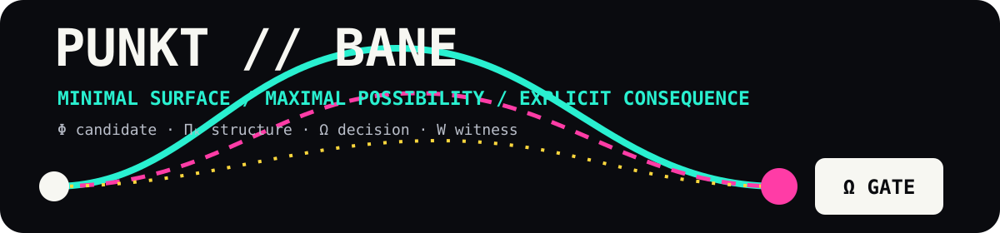

<p align="center">
  
</p>

<h1 align="center">Epistemic Architectures</h1>

<p align="center">
  <strong>PUNKT // THEORY</strong><br />
  Stable reference anchor for realization grammars, supervisory control, AI governance, and fail-closed consequence boundaries.
</p>

<p align="center">
  
  
  
  
  <a href="https://github.com/sololys/epistemic-architectures/wiki"></a>
</p>

## 🏛️ Epistemic Foundation: Decoupling Generation from Consequence

> *Modern computational architectures suffer from a dangerous conflation, routinely mistaking the rapid generation of high-confidence predictions for a mandate to alter physical reality. This systemic vulnerability arises when the velocity of a deep optimization loop is allowed to bypass structural governance, effectively collapsing hypothesis into consequence. To arrest this drift, an epistemic architecture must impose a fundamental mathematical invariant: the absolute decoupling of candidate generation from realized execution. A proposed state transition, regardless of its statistical certainty or the sophistication of its origin, remains nothing more than a speculative artifact until it crosses an explicit, deterministic threshold.*
>
> *This decoupling is not enacted as a flexible administrative policy but as an immutable geometric boundary. Within this framework, generative dynamics are permitted to endlessly produce possibilities, mapping the volatile topology of unresolved paths. However, these exploratory trajectories are structurally contained. Before any speculative candidate can bridge the gap into physical consequence, it must endure a rigorous admissibility projection. It is here, at the fail-closed gate of realization, that the system shifts from probabilistic calculation to deterministic law. Operational authority is entirely stripped from the generative engine and relocated to a regulatory membrane, which demands cryptographic witnessing and irrevocable proof before reality is permitted to unfold.*
>
> *The spatialization of this authority manifests through a strict structural dichotomy between the bounded decision surface and the unresolved path-field. The architecture deliberately isolates the noise of exploratory generation—the dense, untamed trajectories of the working domain—from the public stillness of canonical theory. This stratification ensures that raw intellectual inquiry never accidentally acquires the status of operational truth. A theoretical reference remains purely descriptive, functioning as a stable anchor for mathematical definitions and finite-state grammars rather than an executable command. By containing volatility within isolated sinks and preserving the foundational reference as a sanitized, read-only ledger, the framework prevents epistemic contamination across its interfaces.*
>
> *Ultimately, this architecture redefines the nature of supervisory control, stripping away the illusion that task-level optimization inherently understands physical safety. It enforces a paradigm where structural restriction is not a limitation on computational power, but the precise mechanism that makes physical integration survivable. By isolating the heuristics of discovery from the rigid logic of survival, the system guarantees that no volume of simulated success can bypass the gate of consequence. Realization is thus transformed from a probabilistic outcome into a deterministic privilege, governed by an architecture that is defined precisely by what it refuses to authorize.*

---

## Start at the point

> **Generated candidates are not consequences.**

This work studies systems where proposed transitions must pass explicit structural, admissibility, and governance checks before they can become authorized outcomes.

```text
Φ GENERATE → Πₖ PROJECT → Ω OPEN / HOLD / KILL → W WITNESS
```

Dynamics may generate possibilities. The architecture decides what may cross into consequence.

## PUNKT // BANE

| Plate | Meaning |
|---|---|
| `PUNKT` | The visible, bounded decision surface |
| `BANE` | The larger field of candidate paths and unresolved possibility |
| `Πₖ // CUT` | Projection against structure, type, boundary, and invariants |
| `Ω // GATE` | Explicit authorization: `OPEN`, `HOLD`, or `KILL` |
| `W // RECORD` | Downstream witness of evaluation or realized transition |

## Choose a route

| Route | Surface | Use it for |
|---|---|---|
| **READ** | [`epistemic-architectures`](https://github.com/sololys/epistemic-architectures) | Stable definitions, architectural framing, and citation |
| **RUN** | [`ky-rox-public-demonstrators`](https://github.com/sololys/ky-rox-public-demonstrators) | Deterministic public software demonstrations |
| **EXPLORE** | [`epistemic-architectures-notes`](https://github.com/sololys/epistemic-architectures-notes) | Working notes, sketches, and non-canonical extensions |
| **WIKI** | [`epistemic-architectures/wiki`](https://github.com/sololys/epistemic-architectures/wiki) | Comprehensive theory portal, formalisms, and governance |
| **CITE** | [Zenodo working paper](https://doi.org/10.5281/zenodo.18436983) | Persistent scholarly reference |

The public design and naming rules are documented in [`BRAND_SYSTEM.md`](BRAND_SYSTEM.md). A deploy-ready GitHub profile text is available in [`PROFILE_README.md`](PROFILE_README.md).

## Repository role

This repository is the conservative theory anchor of the ecosystem. It preserves architectural definitions, separation of concerns, and epistemic constraints. Active demonstrators and exploratory notes live on separate public surfaces so that location cannot be confused with authority.

```text
THEORY != DEMONSTRATOR
WORKING NOTE != CANON
OPEN != COMMITTED
WITNESS != AUTHORITY
```

## Scope

Topics include:

- epistemic uncertainty and confidence-aware operation;
- supervisory control and governance overlays;
- finite-state supervision and graceful degradation;
- admissibility testing before irreversible consequence;
- separation of governance logic from task-level optimization;
- witnessed computation and explicit commit boundaries.

## Status and boundary

**Stable reference repository / descriptive architecture / non-operational.**

This repository does not provide a deployed safety system, certified control system, production interlock, physical hardware validation, or empirical physics validation. It is designed to be read as an architectural reference, not as executable authority.

## Treatises and Foundations

- [`KY_NASH_ADMISSIBLE_GAMES.md`](KY_NASH_ADMISSIBLE_GAMES.md) — *KY–Nash Spillteori: Håndbok for Admissible Overganger (Admissible Equilibrium: A KY–Nash Theory of Strategic Consequence).* The formal game theory of realization: game as a history of authorized transitions, four-step chain $a'_{t+1} \to \tilde{a}_{t+1} \to \Omega \to a_{t+1}$, Integrity-Adjusted Payoff ($U_i = u_i - C_K - S_{\mathrm{irr}} - R_W$), the strategic surface ($\text{Payoff} \times \text{Admissibility}$), definition of KY–Nash equilibrium as the absence of improving $\mathrm{OPEN}$-vectors, elimination of *Ghost Wins*, and the whistleblower case study.
- [`NASH_MATHEMATICAL_INVARIANTS_AND_STRUCTURES.md`](NASH_MATHEMATICAL_INVARIANTS_AND_STRUCTURES.md) — *Analytisk Syntese: Nashs Matematiske Invarianter og Strukturer (Analytical Synthesis: Nash's Mathematical Invariants, Tame Estimates, and Admissibility Geometry).* Formal synthesis of Kakutani game-theoretic fixed points ($C^0$) vs. infinite-dimensional Nash-Moser PDE embedding ($C^\infty$) with tame estimates, the sequential ontology $x_{t+1} = \Omega(\Pi_K(R(\Phi(x_t))))$, and the proof that realized dynamics are non-involutive projections of an underlying involutive consistency structure.
- [`THERMODYNAMIC_CONSTRAINTS_AND_DISSIPATION.md`](THERMODYNAMIC_CONSTRAINTS_AND_DISSIPATION.md) — *En kontrollteoretisk og termodynamisk analogi for fysisk realiserte constraints i dissipative systemer (Control-Theoretic and Thermodynamic Analogy for Physically Realized Constraints in Dissipative Systems).* Strict physical and thermodynamic hygiene for projection-constrained realization: zero-work passive constraints ($\dot{W}_c = F_c \cdot \dot{q} = 0$), decoupled irreversible dissipation ($\dot{S}_{\mathrm{irr}} \ge 0$), relativistic 4-divergence covariance ($\nabla_\mu s^\mu = \sigma \ge 0$), resolution of Ostrogradsky ghosts via domain restriction, and Landauer-bounded informational recording without microstate recurrence.
- [`THE_UNIFIED_FIELD_NASH_DUALITY.md`](THE_UNIFIED_FIELD_NASH_DUALITY.md) — *The Unified Field: John Nash’s Duality, K-Filter Gravity, and KY-Nash Admissibility.* Complete isomorphism between topological game equilibrium ($C^0$) and isometric embedding ($C^\infty$), non-equilibrium gravitational stress tensor $\Sigma_{\mu\nu}^{\mathrm{irr}}$, Circuit QED pre-actuation gating, and deconstruction of Napoleon’s 1812 campaign as boundary collapse.
- [`PROJECTION_CONSTRAINED_REALIZATION.md`](PROJECTION_CONSTRAINED_REALIZATION.md) — *Projection-Constrained Realization and Nash-Type Fixed Points in Physical Systems.* Formal proof of $\text{Reality} = \operatorname{Fix}(\Pi \circ \Phi) = \ker(E)$, non-involutive realization from idempotent projection, Nash-admissibility equivalence, General Relativity as an equilibrium limit, and Infranett as the physical fixed point.
- [`QUANTUM_GRAMMAR.md`](QUANTUM_GRAMMAR.md) — *Quantum Grammar: The Gate Between Possibility and Event.* Formal translation of quantum mechanics into realization grammar ($\psi_t$ as candidate field, $\Pi_Q$ admissibility projection, $\Omega_Q$ consequence gate, and measurement as authorized commit into Witness memory).
- [`OMNI_KY_REALIZATION_GRAMMAR.md`](OMNI_KY_REALIZATION_GRAMMAR.md) — *OMNI-KY Canon: The Philosophy and Physics of Realization Grammar.* Foundational ontology of the gate, transition domains `[0] ──▶ (○) ──▶ (◇) ──▶ [□] ──▶ (△) ──▶ (O) ──▶ [●] ──▶ [1]`, double-pulse involution, Landauer dissipation, integrability triads, KY-Nash viability, and the Porter with the feather in his hat.
- [`THE_NON_EXPANSIVE_GATE.md`](THE_NON_EXPANSIVE_GATE.md) — *The Non-Expansive Gate: Computational Complexity as the Boundary Condition of Spacetime and Perception.* Formal analysis of the Cook-Levin space-time tableau, continuous attractor manifolds ($\mathbb{T}^2$), metric projection $\Pi_A$, and subtractive realization.

## Publication

**Torjusen, M. E. (2026).**  
*Epistemic Architectures: Systems That Know They Know.*  
Working paper, Zenodo.  
DOI: [10.5281/zenodo.18436983](https://doi.org/10.5281/zenodo.18436983)

## Author

**Marius Egerhei Torjusen**  
ORCID: [0009-0006-0431-6637](https://orcid.org/0009-0006-0431-6637) · LinkedIn: [marius-torjusen-9aa392392](https://www.linkedin.com/in/marius-torjusen-9aa392392/)

## Citation

Torjusen, M. E. (2026). *Epistemic Architectures: Systems That Know They Know.* Zenodo. [https://doi.org/10.5281/zenodo.18436983](https://doi.org/10.5281/zenodo.18436983). Associated paper license: CC BY-ND 4.0.

---

<p align="center"><code>MAXIMAL CORE / MINIMAL SURFACE / EXPLICIT CONSEQUENCE</code></p>
